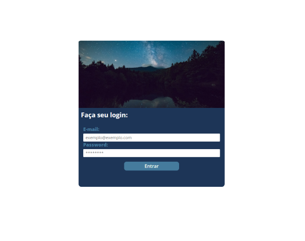
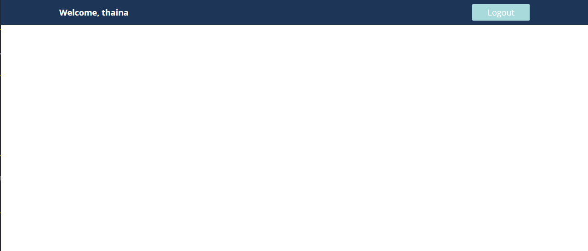

# Sistema de Login

Projeto de um sistema basico de login em php. 

----------

### **Tecnologias usadas neste projeto:**

- Composer;
- Twig;
- Banco de dados; 

### **O que aprendi ?**

Durante o desenvolvimento do projeto compreendi melhor a arquitetura MVC ( Model, View, Controller), distitruição das responsbilidades, tratamento das rotas passadas pela url, validação basica do dados informados na tela de login.
O *core* da aplicação tem a respobilidade de tratar as requestes da aplicação e ligar a modal com o controller, e assim construir as interfaces e aplicar as regras de validação do login do usuário, se o usuário não cadastrado tentar acessar a aplicação tera uma mensagem notificando que a tentativa foi invalide.

----------

### **Conclusão:**

O projeto tem um grau intermediario de dificuldade oriundo da arquitetura adotada mas após sua conclusão foi possivel compreeder melhor o fluxo de funcionamento da arquitetura MVC. O projeto oferece uma amplo número de possibilidades para expanções como: Construção da página de cadastro, recuparação da senha, entre outros. 
  